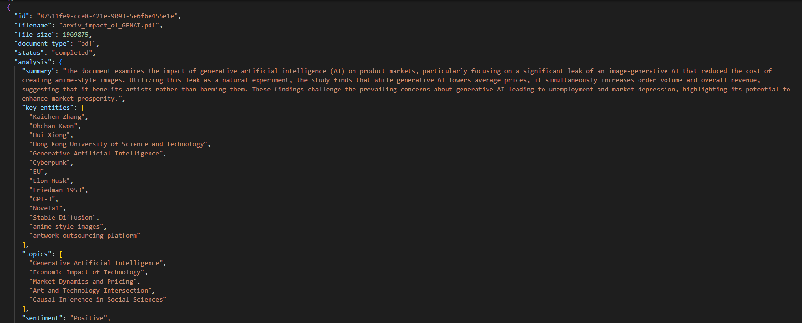

# 📄 Document Intelligence API

The **Document Intelligence API** is a Python-based backend that enables intelligent document ingestion, analysis, and semantic search. It is capable to generate summarization, identify the key entities, detect the topics and to do the sentiment analysis on the ingested document by performing semantic search using OpenAI embeddings and a vector database.
It combines **FastAPI**, **Celery**, and **AI-powered NLP models** to extract insights from uploaded files and provide structured responses through REST endpoints.

---

## Sample of a response generated by the service showing the Summary, Key Entities, Topics amd Sentiment analysis for a given PDF document



## 🚀 Features

- 📂 Upload and process documents (PDF, DOCX, TXT, etc.)
- 🤖 AI-powered document analysis:
  - Text extraction
  - Summarization
  - Entity recognition (people, places, organizations, concepts)
  - Topic detection
  - Sentiment analysis
- 🔎 Semantic search using embeddings and a vector database
- ⚡ Asynchronous background processing with Celery + Redis
- 🗄️ Document metadata and results stored in a relational database

---

## 🧩 Architecture & Concepts

- **FastAPI** → Provides RESTful endpoints for document operations
- **Celery + Redis** → Background job queue for scalable async processing
- **OpenAI API** → NLP and embeddings for document intelligence
- **SQLAlchemy** → Database ORM for storing documents and results
- **Vector Store** → Embeddings storage and semantic retrieval
- **Docker-ready** → Designed to be containerized for deployment

---

## 🛠️ Tech Stack

- **Python 3.11+**
- **FastAPI** (web framework)
- **Celery** (task queue)
- **Redis** (message broker & result backend)
- **SQLAlchemy** (ORM & DB layer)
- **OpenAI API** (document analysis and embeddings)
- **Pydantic** (data validation and response models)

---

## 📦 Getting Started

### 1. Clone & Install
```bash
git clone https://github.com/thiago-maganha/generative-ai.git
cd document-intelligence-api
python -m venv venv
source venv/bin/activate  # or .\venv\Scripts\activate on Windows
pip install -r requirements.txt