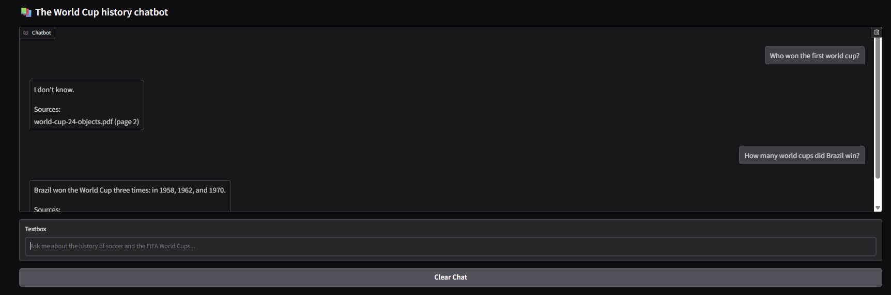

# ⚽ Soccer History Chatbot

A conversational AI chatbot specialized in soccer history and FIFA World Cup knowledge, built with RAG (Retrieval-Augmented Generation) architecture using LangChain and Gradio.



## 🌟 Features

- **Interactive Chat Interface**: Clean, modern web interface powered by Gradio
- **Specialized Knowledge**: Focuses on soccer history and FIFA World Cup information
- **Source Citations**: Provides references to source documents for transparency
- **Conversation Memory**: Maintains chat history throughout the session
- **Vector-Based Retrieval**: Uses semantic search to find relevant information

## 🏗️ Architecture & Concepts

### RAG (Retrieval-Augmented Generation)
This project implements a RAG system that combines:
- **Retrieval**: Finding relevant documents from a knowledge base
- **Augmentation**: Enriching user queries with retrieved context
- **Generation**: Using an LLM to generate informed responses

### Key Components

#### 1. **Vector Database (ChromaDB)**
- Stores document embeddings for semantic search
- Enables fast similarity-based retrieval
- Persists data locally in `chroma_store` directory

#### 2. **Embeddings (OpenAI text-embedding-3-small)**
- Converts text into high-dimensional vectors
- Enables semantic similarity calculations
- Used for both document indexing and query processing

#### 3. **Large Language Model (OpenAI GPT)**
- Generates human-like responses based on retrieved context
- Temperature set to 0 for consistent, factual responses
- Handles conversational flow and maintains context

#### 4. **LangChain Framework**
- **Document Chain**: Processes retrieved documents with custom prompts
- **Retrieval Chain**: Orchestrates the entire RAG pipeline
- **Chat History**: Maintains conversation context across turns

#### 5. **Gradio Interface**
- Provides user-friendly web interface
- Real-time message rendering
- Chat history management and clearing functionality

## 🛠️ Technical Stack

- **Python 3.8+**
- **LangChain**: RAG pipeline orchestration
- **ChromaDB**: Vector database for document storage
- **OpenAI API**: Embeddings and chat completion
- **Gradio**: Web interface framework

## 📁 Project Structure

```
soccer-history-chatbot/
├── src/
│   └── app.py
├── venv/                 
├── requirements.txt
├── .env                 
└── README.md
```

## 🚀 Setup & Installation

### Prerequisites
- Python 3.8 or higher
- OpenAI API key

### Installation Steps

1. **Clone the repository**
   ```bash
   https://github.com/thiagomaganha/Generative-AI.git
   cd soccer-history-chatbot
   ```

2. **Create virtual environment**
   ```bash
   python -m venv venv
   source venv/bin/activate  # On Windows: venv\Scripts\activate
   ```

3. **Install dependencies**
   ```bash
   pip install -r requirements.txt
   ```

4. **Set up environment variables**
   ```bash
   export OPENAI_API_KEY="your-openai-api-key-here"
   ```
   
   Or create a `.env` file:
   ```
   OPENAI_API_KEY=your-openai-api-key-here
   ```

5. **Prepare your knowledge base**
   - Add your soccer history documents to the vector database
   - Run the indexing script (if you have one) to populate ChromaDB

6. **Run the application**
   ```bash
   python src/app.py
   ```

## 📚 Core Concepts Explained

### Vector Embeddings
Text documents are converted into numerical vectors that capture semantic meaning. Similar concepts cluster together in vector space, enabling the system to find relevant information even when exact keywords don't match.

### Semantic Search
Instead of keyword matching, the system understands the meaning of queries and finds contextually relevant documents. This allows for more natural, conversational interactions.

### Prompt Engineering
The custom prompt template guides the AI to:
- Stay focused on soccer history topics
- Admit when information isn't available in the knowledge base
- Provide structured, helpful responses with source citations

### Conversation Context
The system maintains chat history to understand follow-up questions and provide coherent multi-turn conversations while avoiding repetition.

## 💡 Usage Examples

**Query**: "Who won the 1970 World Cup?"
**Response**: Based on the retrieved documents about the 1970 FIFA World Cup, along with source citations.

**Follow-up**: "Tell me more about their performance"
**Response**: Uses conversation context to understand "their" refers to the 1970 World Cup winners.

## 🔧 Customization

### Modifying the Knowledge Domain
- Update the system prompt in `custom_prompt` to change the specialization
- Replace your document collection and re-index the vector database

### Adjusting Retrieval Parameters
- Modify `search_kwargs={"k":3}` to retrieve more or fewer documents
- Experiment with different embedding models for better performance

### UI Customization
- Modify the Gradio interface components
- Add new features like file upload or export functionality

## 🤝 Contributing

1. Fork the repository
2. Create a feature branch (`git checkout -b feature/amazing-feature`)
3. Commit your changes (`git commit -m 'Add amazing feature'`)
4. Push to the branch (`git push origin feature/amazing-feature`)
5. Open a Pull Request

## 📝 License

This project is licensed under the MIT License - see the [LICENSE](LICENSE) file for details.

## ⚠️ Important Notes

- Requires OpenAI API access (costs may apply)
- Vector database needs to be populated with your documents before use
- Responses are limited to information in the knowledge base
- Chat history is cleared when the application restarts

## 🔗 Useful Resources

- [LangChain Documentation](https://python.langchain.com/)
- [ChromaDB Documentation](https://docs.trychroma.com/)
- [Gradio Documentation](https://gradio.app/docs/)
- [OpenAI API Documentation](https://platform.openai.com/docs/)

---

Built with ❤️ for soccer enthusiasts and AI learners!